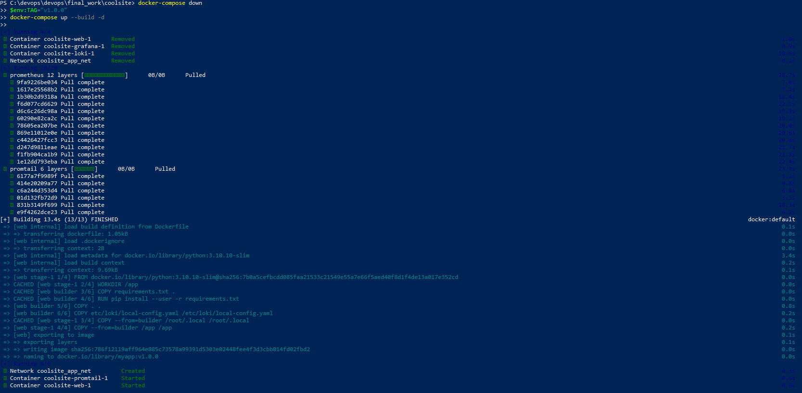
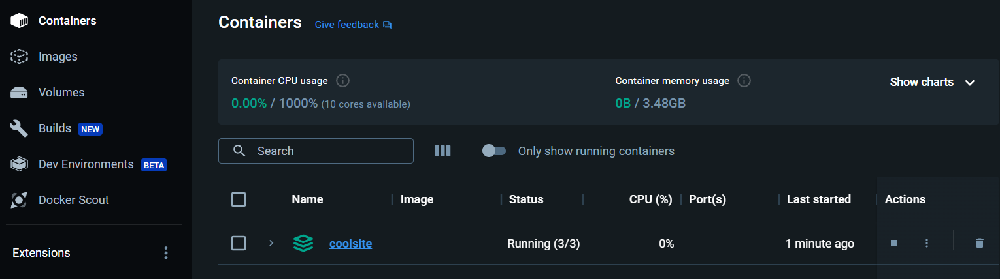
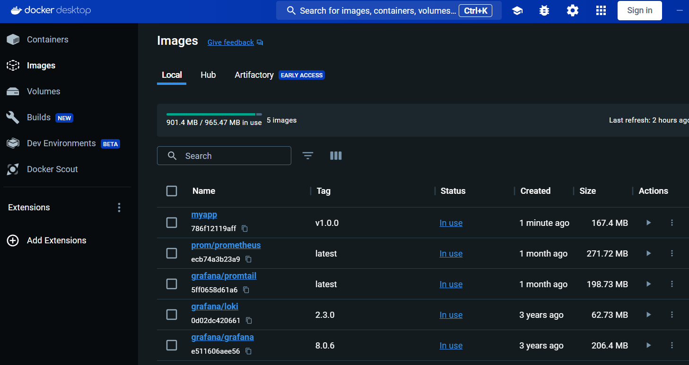
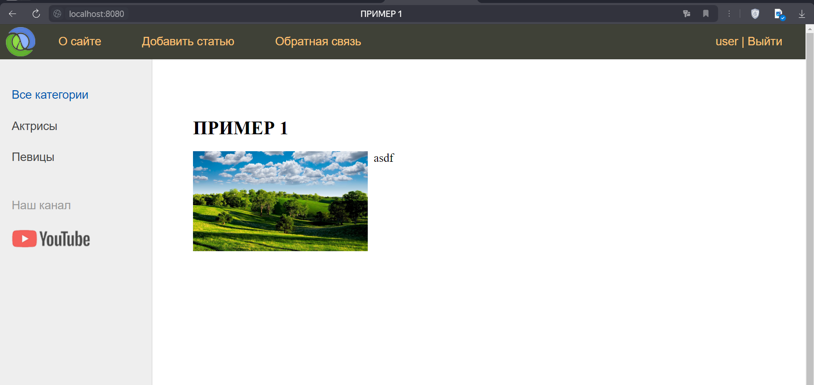
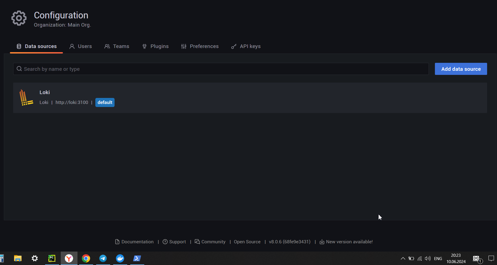
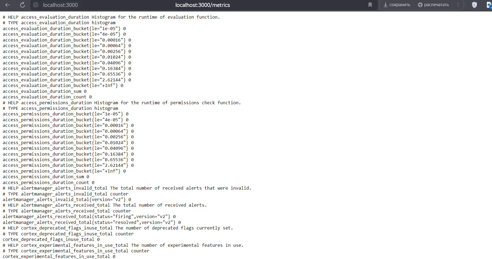
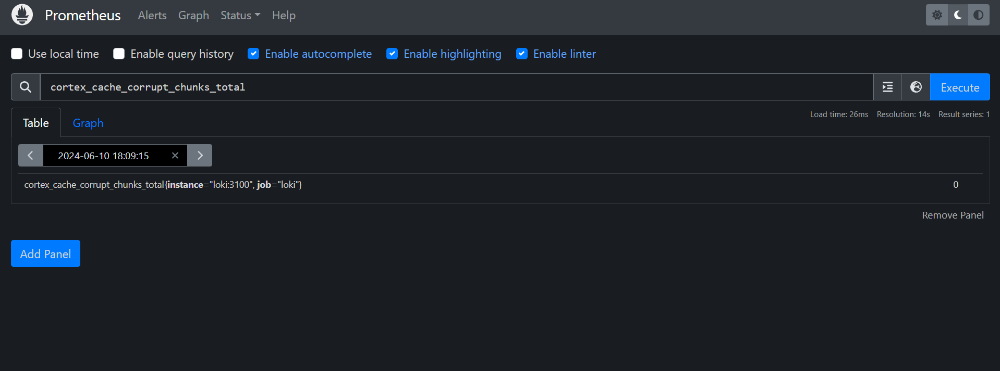

Запускаем контейнеры

Образы

Переходим по этой ссылке http://localhost:8080

Попадаем на сайт, все работает

Добавляем data sources

Переходим по ссылке http://localhost:9090 на Prometheus для просмотра метрик
