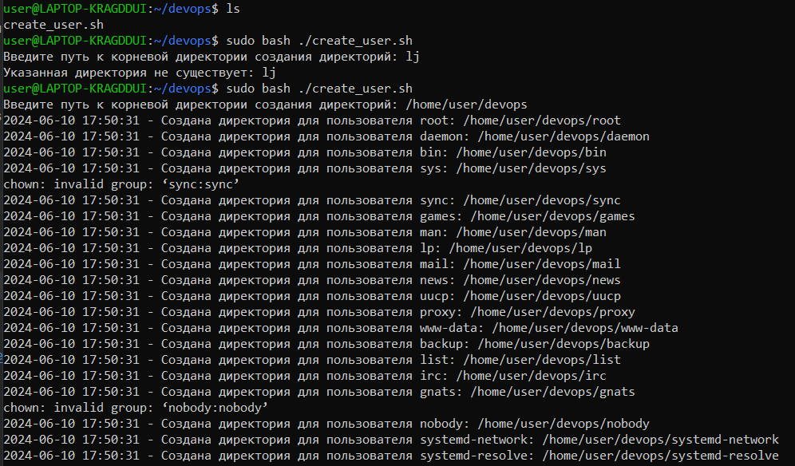
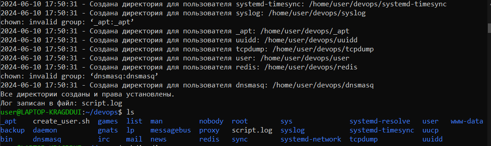
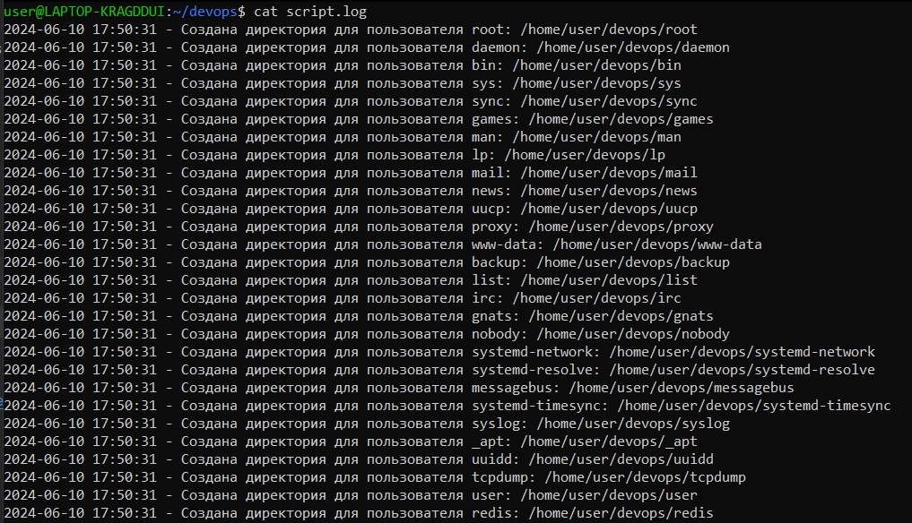
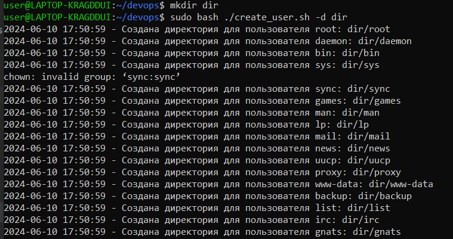

# Скрипт для создания директорий пользователей

Этот Bash-скрипт создает директорию для каждого пользователя системы в указанной базовой директории. Он устанавливает права на директорию `755` и назначает владельцем соответствующего пользователя.

## Использование

### Запуск скрипта


1. **Запустите скрипт с правами суперпользователя**:
    ```bash
    sudo ./create_user.sh
    ```

2. **При появлении запроса введите базовую директорию**, в которой должны быть созданы директории пользователей (например, `/home/user`).

### Опции скрипта

- `-d <directory>`: Указание базовой директории через ключ `-d`.

## Логи

Все действия скрипта логируются как в stdout, так и в файл `user_creation.log`.

## Демонстрация работы







